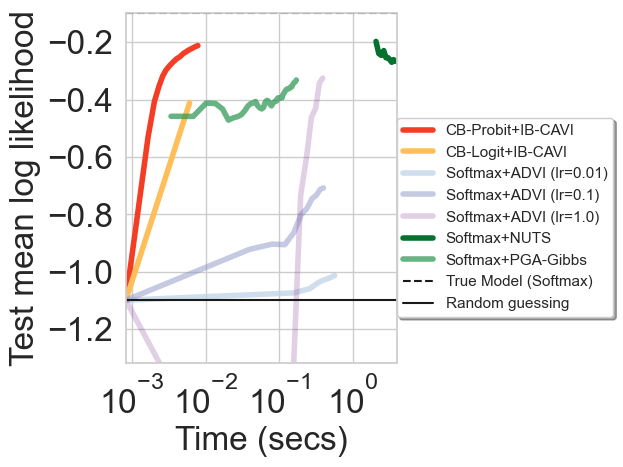
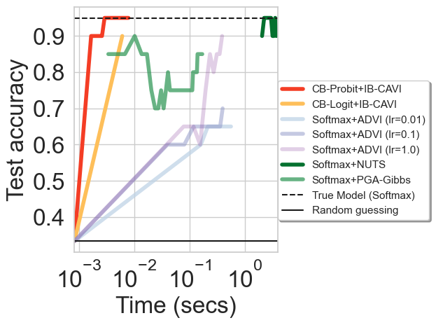

# categorical\_from\_binary

Welcome to `categorical_from_binary`, a Python code package that lets you perform fast Bayesian inference on linear models for categorical data.

This is the code repository for our ICML 2022 paper:

Easy Variational Inference for Categorical Models via an Independent Binary Approximation
<br />Michael T Wojnowicz, Shuchin Aeron, Eric L Miller, Michael C. Hughes
<br />Proceedings of the 39th International Conference on Machine Learning (ICML), 2022
<br /><https://proceedings.mlr.press/v162/wojnowicz22a.html> &#8226; <https://arxiv.org/abs/2206.00093>

Our methods have two main advantages:

* **simplicity**: We use an independent Binary approximation that makes inference "easy" using well-known Bayesian methods for binary outcomes
* **scalability** : Our code can handle hundreds or thousands of categories easily

You can use this repo to:

* reproduce the accuracy-over-time experiments in the paper
* run our categorical-from-binary models on your own data

**Jump to**: [Installation](#installation) &#8226; [Demo](#demo) &#8226; [Usage](#usage) &#8226; [References](#references) 

# Installation

Installation requires python3 and the `tox` package. 

This package is not yet published to PyPI, so the first step is to clone this repo.  

Using `make`, we can create a virtual environment and install categorical\_from\_binary via the command:

```
make env
```

Run unit tests:

```
make test
```

To work interactively (e.g. in IPython), be sure to load the virtual environment (`source env/bin/activate`) before proceeding. 


# Demo
The following code (using [these configs](configs/performance_over_time/demo_sims.yaml) by default)  will provide a quick demo of how categorical-from-binary models can be used to obtain fast Bayesian inference on categorical models.  


```python
from categorical_from_binary.performance_over_time.main import run_performance_over_time

path_to_configs = "configs/performance_over_time/demo_sims.yaml"
run_performance_over_time(path_to_configs)
```

First, we simulate categorical regression data from a softmax model.  

Then we do approximate Bayesian inference.    

1. We apply our proposed approximate Bayesian inference method: 

 * IB-CAVI (Independent Binary - Coordinate Ascent Variational Inference).

   This method uses categorical-from-binary likelihoods, which have natural independent binary approximations.  

2. For baseline methods, we fit the softmax likelihood to this data using:
 
 * NUTS (No U-Turn Sampler)
 * Gibbs sampling (via Polya-Gamma augmentation)
 * Automatic differentiation variational inference.

The code will automatically write holdout-performance-over-time plots to `data/results/demo_sims/`.  The plots will look like this:

<p float="left">
  
   
</p>

More extensive [experiments](/src/categorical_from_binary/experiments) can take substantially longer to run than this quick demo.  Results from those experiments are summarized in the paper.

# Usage

Would you like to apply IB-CAVI to your own data?  Usage is demonstrated in [this python script](/src/categorical_from_binary/ib_cavi/multi/demo.py).  

```python
from categorical_from_binary.ib_cavi.multi.inference import (
    IB_Model,
    compute_ib_cavi_with_normal_prior,
)

results = compute_ib_cavi_with_normal_prior(
    IB_Model.PROBIT,
    labels_train,
    covariates_train,
    labels_test=labels_test,
    covariates_test=covariates_test,
    variational_params_init=None,
    convergence_criterion_drop_in_mean_elbo=0.01,
)
```


# References

If you use this package in your research, please cite our paper:

Easy Variational Inference for Categorical Models via an Independent Binary Approximation
<br />Michael T Wojnowicz, Shuchin Aeron, Eric L Miller, Michael Hughes
<br />Proceedings of the 39th International Conference on Machine Learning (ICML), 2022
<br /><https://proceedings.mlr.press/v162/wojnowicz22a.html>
